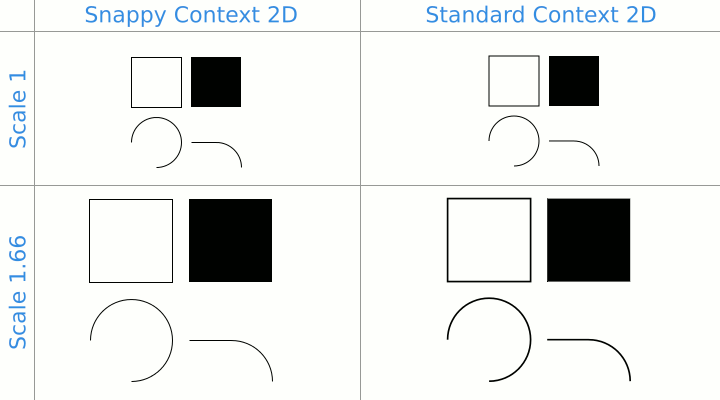

# SnappyCanvas - Canvas where everything is snapped to nearest pixel

[](https://travis-ci.org/wanadev/snappy-canvas)
[](https://www.npmjs.com/package/snappy-canvas)
[](https://github.com/wanadev/snappy-canvas/blob/master/LICENSE)

Snappy canvas is an HTML5 canvas that provides a `"snappy"` 2D context that
provides an API similar to the standard 2D context but that approximate
everything to the nearest pixel: no more blurry draw!



```javascript
var canvas = new SnappyCanvas({
    width: 300,
    height: 300
});

var ctx = canvas.getContext("snappy");

ctx.strokeRect(10, 10, 50, 50);
ctx.fillRect(70, 10, 50, 50);

ctx.beginPath();
ctx.arc(35, 95, 25, Math.PI, 2.5 * Math.PI);
ctx.stroke();

ctx.beginPath();
ctx.moveTo(70, 95);
ctx.arcTo(120, 95, 120, 120, 25);
ctx.stroke();

ctx.render();
```

* Live example on JSFiddle: [https://jsfiddle.net/hq746L43/3/](https://jsfiddle.net/hq746L43/3/)


## SnappyCanvas API

### Constructor

    var canvas = new SnappyCanvas([options={}]) -> HTMLCanvasElement


* `options`: Object -- The SnappyCanvas and SnappyContext2D options.

```javasctipt
{
    // SnappyCanvas options
    width: <Number>,               // Width of the canvas HTML element
    height: <Number>,              // Height of the canvas HTML element
    contentWidth: <Number>,        // Width of the drawing at scale 1 (useful when autoResize = true)
    contentHeight: <Number>,       // Height of the drawing at scale 1 (useful when autoResize = true)

    // SnappyContext2D options
    globalScale: <Number>,         // Initial scale of the snappy context (default 1)
    globalTranslationX: <Number>,  // Initial translation x of the snappy context (default 0)
    globalTranslationY: <Number>,  // Initial translation y of the snappy context (default 0)
    scaleLineWidth: <Boolean>,     // If true, the snappy context will scale the line width according to scale (default true)
    autoResizeCanvas: <Boolean>    // Allow canvas to be resized when `SnappyContext2D.globalScale` changes
}
```

__NOTE:__ The constructor returns a standard `HTMLCanvasElement` augmented with
some additional properties.

### SnappyCanvas.getContext()

    canvas.getContext(contextType [, contextAttributes]) -> SnappyContext2D

Like the standard [`HTMLCanvasElement.getContext()`][canvas-getcontext] but
with an additional `contextType`: `"snappy"`.

Example:

```javascript
var ctx = canvas.getContext("snappy");
```

### SnappyCanvas.contentWidth

    canvas.contentWidth = <Number>

Width of the drawing at scale 1 (useful when `autoResize` enabled).

### SnappyCanvas.contentHeight

    canvas.contentHeight = <Number>

Height of the drawing at scale 1 (useful when `autoResize` enabled).


## SnappyContext2D

`SnappyContext2D` provides most of the standard
[`CanvasRenderingContext2D`][ctx2d] and works almost the same.

The main differences between the standard context 2D and the snappy context 2D
are:

* the snappy context 2D **do not** draw anything when you call drawing
  operation: it just stack the operations and draw everything when you call the
  `render()`.
* you can change the global scale and translation of the snappy context at any
  time and **everything will be automatically redraw** according to the new
  parameters (no need to repeat the operations yourself).

To access to the snappy context, just request it from a `SnappyCanvas`:

```javascript
var canvas = new SnappyCanvas();
var ctx = canvas.getContext("snappy");
```

### SnappyContext2D.globalTranslationX

    ctx.globalTranslationX = <Number>

The global translation of the canvas (offset x).

__NOTE:__ The canvas is automatically updated when this value is changed.

### SnappyContext2D.globalTranslationY

    ctx.globalTranslationY = <Number>

The global translation of the canvas (offset y).

__NOTE:__ The canvas is automatically updated when this value is changed.

### SnappyContext2D.globalScale

    ctx.globalScale = <Number>

The global scale of the canvas.

__NOTE:__ The canvas is automatically updated when this value is changed.

### SnappyContext2D.scaleLineWidth

    ctx.scaleLineWidth = <Boolean>

Determine if the line width is scaled (`true`, default) or if it keep the same
thickness at each scale (`false`).

__NOTE:__ The canvas is automatically updated when this value is changed.

### SnappyContext2D.setSnappyOptions()

    ctx.setSnappyOptions(options)

Set multiple options in one round.

* `options`: Object -- The SnappyContext2D options.

```javasctipt
{
    globalScale: <Number>,         // Initial scale of the snappy context (default 1)
    globalTranslationX: <Number>,  // Initial translation x of the snappy context (default 0)
    globalTranslationY: <Number>,  // Initial translation y of the snappy context (default 0)
    scaleLineWidth: <Boolean>,     // If true, the snappy context will scale the line width according to scale (default true)
    autoResizeCanvas: <Boolean>    // Allow canvas to be resized when `SnappyContext2D.globalScale` changes
}
```

__NOTE:__ The canvas is automatically updated when this value is changed.

### SnappyContext2D.clear()

    ctx.clear()

Clear the canvas and empty the drawing operation stack. Must be used as
replacement of `ctx.clearRect(0, 0, canvas.width, canvas.height)`) to clear the
canvas.

### SnappyContext2D.render()

    ctx.render()

(Re)paint all the drawing.

### CanvasRenderingContext2D supported operations

TODO

### CanvasRenderingContext2D unsupported operations

TODO


[canvas-getcontext]: https://developer.mozilla.org/en-US/docs/Web/API/HTMLCanvasElement/getContext
[ctx2d]: https://developer.mozilla.org/en-US/docs/Web/API/CanvasRenderingContext2D
